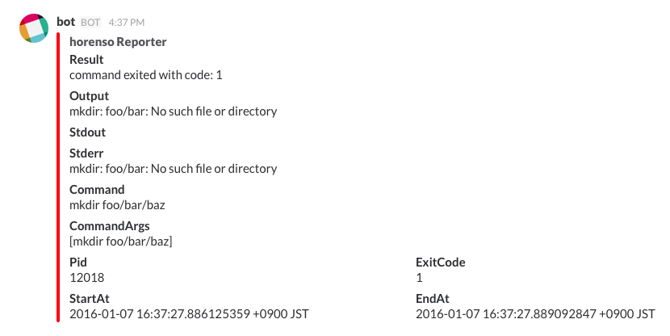

horenso-reporter-slack
=====================



## Usage

```shell
$ go get github.com/Songmu/horenso/cmd/horenso
$ go build
$ SLACK_TOKEN="YOUR_SLACK_TOKEN" SLACK_GROUP="GROUP_NAME" horenso -r ./horenso-reporter-slack -- [command]
```

## License

MIT

## Author

[Takuya Arita](https://github.com/ariarijp)
